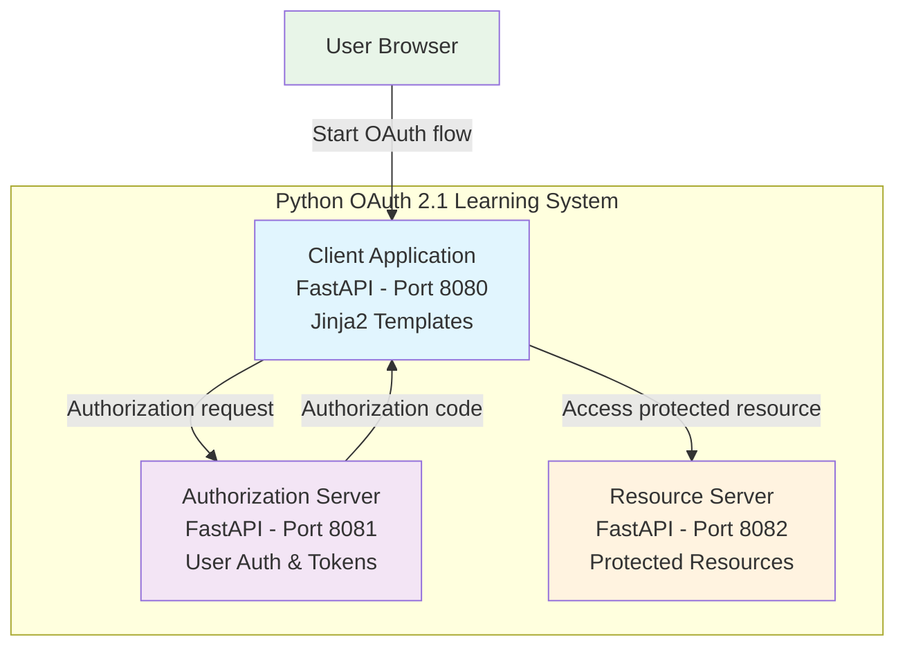

# Design Document

## Overview

The Python OAuth 2.1 learning project will be built using FastAPI as the web framework and uv for package management. This implementation will mirror the educational structure of the Go version while leveraging Python's ecosystem and FastAPI's modern async capabilities. The system maintains the same three-component architecture with enhanced Python-specific features like automatic API documentation and type hints.

## Architecture

### System Components

The system consists of three independent FastAPI applications:



### Technology Stack

- **Web Framework**: FastAPI 0.104+
- **Package Manager**: uv
- **Template Engine**: Jinja2
- **Password Hashing**: bcrypt via passlib
- **Cryptography**: Python cryptography library
- **HTTP Client**: httpx (async)
- **Logging**: Python logging with colorama for colored output
- **Data Validation**: Pydantic (built into FastAPI)

### Project Structure

```
python-oauth-learning/
├── pyproject.toml              # uv project configuration
├── README.md                   # Educational documentation
├── requirements.txt            # Dependencies (generated by uv)
├── src/
│   ├── shared/                 # Common utilities
│   │   ├── __init__.py
│   │   ├── oauth_models.py     # Pydantic models for OAuth
│   │   ├── crypto_utils.py     # PKCE and token generation
│   │   ├── logging_utils.py    # Colored logging utilities
│   │   └── security.py         # Password hashing, validation
│   ├── client/                 # Client application
│   │   ├── __init__.py
│   │   ├── main.py            # FastAPI app
│   │   ├── routes.py          # OAuth flow endpoints
│   │   ├── templates/         # Jinja2 templates
│   │   └── static/            # CSS, JS files
│   ├── auth_server/           # Authorization server
│   │   ├── __init__.py
│   │   ├── main.py            # FastAPI app
│   │   ├── routes.py          # OAuth endpoints
│   │   ├── models.py          # Data models
│   │   ├── storage.py         # In-memory storage
│   │   └── templates/         # Login forms
│   └── resource_server/       # Resource server
│       ├── __init__.py
│       ├── main.py            # FastAPI app
│       ├── routes.py          # Protected endpoints
│       └── data/              # Protected resources
└── scripts/
    ├── start_all.py           # Start all servers
    ├── hash_passwords.py      # Generate demo passwords
    └── demo_flow.py           # Automated demo script
```

## Components and Interfaces

### Shared Utilities (`src/shared/`)

#### OAuth Models (`oauth_models.py`)
```python
from pydantic import BaseModel, HttpUrl
from typing import Optional
from enum import Enum

class PKCEMethod(str, Enum):
    S256 = "S256"

class AuthorizationRequest(BaseModel):
    client_id: str
    redirect_uri: HttpUrl
    scope: str
    state: str
    code_challenge: str
    code_challenge_method: PKCEMethod
    response_type: str = "code"

class TokenRequest(BaseModel):
    grant_type: str
    code: str
    redirect_uri: HttpUrl
    client_id: str
    code_verifier: str

class TokenResponse(BaseModel):
    access_token: str
    token_type: str = "Bearer"
    expires_in: int = 3600
    scope: str
```

#### Crypto Utilities (`crypto_utils.py`)
```python
import secrets
import hashlib
import base64
from typing import Tuple

class PKCEGenerator:
    @staticmethod
    def generate_challenge() -> Tuple[str, str]:
        """Generate PKCE code verifier and challenge"""
        # 43-character random string
        verifier = base64.urlsafe_b64encode(
            secrets.token_bytes(32)
        ).decode('utf-8').rstrip('=')

        # SHA256 hash of verifier
        challenge = base64.urlsafe_b64encode(
            hashlib.sha256(verifier.encode('utf-8')).digest()
        ).decode('utf-8').rstrip('=')

        return verifier, challenge

    @staticmethod
    def verify_challenge(verifier: str, challenge: str) -> bool:
        """Verify PKCE code verifier against challenge"""
        expected_challenge = base64.urlsafe_b64encode(
            hashlib.sha256(verifier.encode('utf-8')).digest()
        ).decode('utf-8').rstrip('=')

        return expected_challenge == challenge
```

#### Logging Utilities (`logging_utils.py`)
```python
import logging
from colorama import Fore, Style, init
from datetime import datetime
from typing import Dict, Any

init(autoreset=True)  # Initialize colorama

class OAuthLogger:
    def __init__(self, component_name: str):
        self.component_name = component_name
        self.colors = {
            'CLIENT': Fore.BLUE,
            'AUTH-SERVER': Fore.GREEN,
            'RESOURCE-SERVER': Fore.YELLOW,
            'ERROR': Fore.RED,
            'INFO': Fore.CYAN
        }

    def log_oauth_message(self, source: str, destination: str,
                         message_type: str, data: Dict[str, Any]):
        """Log OAuth messages with color coding and formatting"""
        timestamp = datetime.now().strftime("%Y-%m-%d %H:%M:%S")
        color = self.colors.get(source, Fore.WHITE)

        print(f"{color}[{timestamp}] {source} → {destination}")
        print(f"{message_type}:")

        for key, value in data.items():
            if 'password' in key.lower():
                value = '[REDACTED]'
            print(f"  {key}: {value}")

        print("-" * 50)
```

### Client Application (`src/client/`)

#### Main Application (`main.py`)
```python
from fastapi import FastAPI, Request, Form
from fastapi.templating import Jinja2Templates
from fastapi.staticfiles import StaticFiles
from fastapi.responses import HTMLResponse, RedirectResponse
import httpx
from ..shared.oauth_models import AuthorizationRequest, TokenRequest
from ..shared.crypto_utils import PKCEGenerator
from ..shared.logging_utils import OAuthLogger

app = FastAPI(title="OAuth Client", description="OAuth 2.1 Learning Client")
templates = Jinja2Templates(directory="src/client/templates")
app.mount("/static", StaticFiles(directory="src/client/static"), name="static")

logger = OAuthLogger("CLIENT")

# In-memory session storage (for demo purposes)
session_store = {}
```

#### OAuth Flow Routes (`routes.py`)
```python
@app.get("/", response_class=HTMLResponse)
async def start_oauth_flow(request: Request):
    """Display OAuth flow start page with PKCE details"""
    verifier, challenge = PKCEGenerator.generate_challenge()

    # Store PKCE verifier in session
    session_id = secrets.token_urlsafe(16)
    session_store[session_id] = {
        'pkce_verifier': verifier,
        'pkce_challenge': challenge
    }

    # Build authorization URL
    auth_params = {
        'client_id': 'demo-client',
        'redirect_uri': 'http://localhost:8080/callback',
        'scope': 'read',
        'state': 'demo-state-123',
        'code_challenge': challenge,
        'code_challenge_method': 'S256',
        'response_type': 'code'
    }

    logger.log_oauth_message(
        "CLIENT", "USER-BROWSER",
        "Authorization URL Generated",
        {
            "authorization_url": f"http://localhost:8081/authorize?{urlencode(auth_params)}",
            "pkce_challenge": challenge,
            "pkce_method": "S256"
        }
    )

    response = templates.TemplateResponse("start_flow.html", {
        "request": request,
        "auth_url": f"http://localhost:8081/authorize?{urlencode(auth_params)}",
        "pkce_challenge": challenge,
        "client_id": "demo-client"
    })

    response.set_cookie("session_id", session_id)
    return response

@app.get("/callback")
async def oauth_callback(request: Request, code: str = None, error: str = None, state: str = None):
    """Handle OAuth authorization callback"""
    session_id = request.cookies.get("session_id")
    session = session_store.get(session_id, {})

    logger.log_oauth_message(
        "AUTH-SERVER", "CLIENT",
        "Authorization Callback",
        {
            "code": code[:10] + "..." if code else None,
            "state": state,
            "error": error
        }
    )

    if error:
        return templates.TemplateResponse("error.html", {
            "request": request,
            "error": error
        })

    # Store authorization code
    session['auth_code'] = code
    session_store[session_id] = session

    return templates.TemplateResponse("callback.html", {
        "request": request,
        "code": code,
        "state": state
    })
```

### Authorization Server (`src/auth_server/`)

#### Main Application (`main.py`)
```python
from fastapi import FastAPI, Request, Form, HTTPException, Depends
from fastapi.templating import Jinja2Templates
from fastapi.responses import HTMLResponse, RedirectResponse
from ..shared.oauth_models import AuthorizationRequest, TokenRequest, TokenResponse
from ..shared.crypto_utils import PKCEGenerator
from ..shared.security import verify_password, hash_password
from ..shared.logging_utils import OAuthLogger
from .storage import AuthCodeStore, UserStore

app = FastAPI(title="OAuth Authorization Server",
              description="OAuth 2.1 Learning Authorization Server")
templates = Jinja2Templates(directory="src/auth_server/templates")

logger = OAuthLogger("AUTH-SERVER")
auth_code_store = AuthCodeStore()
user_store = UserStore()
```

#### OAuth Endpoints (`routes.py`)
```python
@app.get("/authorize")
async def authorize_endpoint(request: Request,
                           client_id: str,
                           redirect_uri: str,
                           scope: str,
                           state: str,
                           code_challenge: str,
                           code_challenge_method: str,
                           response_type: str = "code"):
    """OAuth 2.1 authorization endpoint"""

    # Validate request
    if response_type != "code":
        raise HTTPException(400, "Only 'code' response type supported")

    if code_challenge_method != "S256":
        raise HTTPException(400, "Only 'S256' PKCE method supported")

    logger.log_oauth_message(
        "CLIENT", "AUTH-SERVER",
        "Authorization Request",
        {
            "client_id": client_id,
            "redirect_uri": redirect_uri,
            "scope": scope,
            "state": state,
            "code_challenge": code_challenge[:10] + "...",
            "code_challenge_method": code_challenge_method,
            "response_type": response_type
        }
    )

    # Store authorization request
    auth_request = AuthorizationRequest(
        client_id=client_id,
        redirect_uri=redirect_uri,
        scope=scope,
        state=state,
        code_challenge=code_challenge,
        code_challenge_method=code_challenge_method,
        response_type=response_type
    )

    return templates.TemplateResponse("login.html", {
        "request": request,
        "auth_request": auth_request,
        "demo_accounts": [
            {"username": "alice", "password": "password123"},
            {"username": "bob", "password": "secret456"},
            {"username": "carol", "password": "mypass789"}
        ]
    })

@app.post("/token", response_model=TokenResponse)
async def token_endpoint(token_request: TokenRequest):
    """OAuth 2.1 token exchange endpoint"""

    logger.log_oauth_message(
        "CLIENT", "AUTH-SERVER",
        "Token Exchange Request",
        {
            "grant_type": token_request.grant_type,
            "redirect_uri": str(token_request.redirect_uri),
            "client_id": token_request.client_id,
            "code_verifier": token_request.code_verifier[:10] + "..."
        }
    )

    # Validate grant type
    if token_request.grant_type != "authorization_code":
        raise HTTPException(400, "Only 'authorization_code' grant type supported")

    # Retrieve and validate authorization code
    auth_code_data = auth_code_store.get_code(token_request.code)
    if not auth_code_data:
        raise HTTPException(400, "Invalid or expired authorization code")

    # Verify PKCE
    if not PKCEGenerator.verify_challenge(
        token_request.code_verifier,
        auth_code_data['code_challenge']
    ):
        logger.log_oauth_message(
            "AUTH-SERVER", "AUTH-SERVER",
            "PKCE Verification Failed",
            {
                "expected_challenge": auth_code_data['code_challenge'][:10] + "...",
                "received_verifier": token_request.code_verifier[:10] + "..."
            }
        )
        raise HTTPException(400, "PKCE verification failed")

    # Generate access token
    access_token = secrets.token_urlsafe(32)

    response = TokenResponse(
        access_token=access_token,
        scope=auth_code_data['scope']
    )

    logger.log_oauth_message(
        "AUTH-SERVER", "CLIENT",
        "Token Response",
        {
            "access_token": access_token[:10] + "...",
            "token_type": "Bearer",
            "expires_in": 3600,
            "scope": auth_code_data['scope']
        }
    )

    return response
```

### Resource Server (`src/resource_server/`)

#### Main Application (`main.py`)
```python
from fastapi import FastAPI, Depends, HTTPException, Header
from fastapi.responses import PlainTextResponse
from typing import Optional
from ..shared.logging_utils import OAuthLogger
import os

app = FastAPI(title="OAuth Resource Server",
              description="OAuth 2.1 Learning Resource Server")

logger = OAuthLogger("RESOURCE-SERVER")

def validate_bearer_token(authorization: Optional[str] = Header(None)) -> str:
    """Validate Bearer token from Authorization header"""
    if not authorization:
        raise HTTPException(401, "Missing Authorization header")

    if not authorization.startswith("Bearer "):
        raise HTTPException(401, "Invalid Authorization header format")

    token = authorization[7:]  # Remove "Bearer " prefix

    # In a real implementation, validate token against database/cache
    # For demo purposes, accept any non-empty token
    if not token:
        raise HTTPException(401, "Empty access token")

    logger.log_oauth_message(
        "RESOURCE-SERVER", "RESOURCE-SERVER",
        "Token Validation Success",
        {
            "user_id": "validated-user",
            "client_id": "demo-client",
            "scope": "read"
        }
    )

    return token

@app.get("/protected", response_class=PlainTextResponse)
async def protected_resource(token: str = Depends(validate_bearer_token)):
    """Serve protected resource content"""

    logger.log_oauth_message(
        "CLIENT", "RESOURCE-SERVER",
        "Protected Resource Request",
        {
            "path": "/protected",
            "method": "GET",
            "authorization": f"Bearer {token[:10]}..."
        }
    )

    # Load protected resource
    try:
        with open("src/resource_server/data/protected-resource.txt", "r") as f:
            content = f.read()
    except FileNotFoundError:
        content = "🔒 This is a protected resource!\n\nYou successfully completed the OAuth 2.1 flow!"

    logger.log_oauth_message(
        "RESOURCE-SERVER", "CLIENT",
        "Protected Resource Response",
        {
            "resource_size": len(content),
            "content_type": "text/plain"
        }
    )

    return content
```

## Data Models

### Storage Models (`auth_server/storage.py`)
```python
from datetime import datetime, timedelta
from typing import Dict, Optional
import secrets

class AuthCodeStore:
    """In-memory storage for authorization codes"""

    def __init__(self):
        self._codes: Dict[str, Dict] = {}

    def store_code(self, client_id: str, user_id: str, scope: str,
                   code_challenge: str, redirect_uri: str) -> str:
        """Store authorization code with metadata"""
        code = secrets.token_urlsafe(32)
        expiry = datetime.utcnow() + timedelta(minutes=10)

        self._codes[code] = {
            'client_id': client_id,
            'user_id': user_id,
            'scope': scope,
            'code_challenge': code_challenge,
            'redirect_uri': redirect_uri,
            'expires_at': expiry,
            'used': False
        }

        return code

    def get_code(self, code: str) -> Optional[Dict]:
        """Retrieve and validate authorization code"""
        code_data = self._codes.get(code)

        if not code_data:
            return None

        if code_data['used']:
            return None

        if datetime.utcnow() > code_data['expires_at']:
            del self._codes[code]
            return None

        # Mark as used
        code_data['used'] = True
        return code_data

class UserStore:
    """In-memory user storage with bcrypt passwords"""

    def __init__(self):
        # Pre-hashed demo passwords
        self._users = {
            'alice': {
                'password_hash': '$2b$12$...',  # password123
                'email': 'alice@example.com'
            },
            'bob': {
                'password_hash': '$2b$12$...',  # secret456
                'email': 'bob@example.com'
            },
            'carol': {
                'password_hash': '$2b$12$...',  # mypass789
                'email': 'carol@example.com'
            }
        }

    def authenticate(self, username: str, password: str) -> Optional[Dict]:
        """Authenticate user with bcrypt"""
        user = self._users.get(username)
        if not user:
            return None

        if verify_password(password, user['password_hash']):
            return {'username': username, 'email': user['email']}

        return None
```

## Error Handling

### Standardized Error Responses
```python
from fastapi import HTTPException
from pydantic import BaseModel

class OAuthError(BaseModel):
    error: str
    error_description: str
    error_uri: Optional[str] = None

class OAuthErrorHandler:
    @staticmethod
    def invalid_request(description: str = "Invalid request"):
        return HTTPException(400, OAuthError(
            error="invalid_request",
            error_description=description
        ).dict())

    @staticmethod
    def invalid_grant(description: str = "Invalid grant"):
        return HTTPException(400, OAuthError(
            error="invalid_grant",
            error_description=description
        ).dict())

    @staticmethod
    def unauthorized_client(description: str = "Unauthorized client"):
        return HTTPException(401, OAuthError(
            error="unauthorized_client",
            error_description=description
        ).dict())
```

## Testing Strategy

### Unit Tests Structure
```python
# tests/test_crypto_utils.py
import pytest
from src.shared.crypto_utils import PKCEGenerator

class TestPKCEGenerator:
    def test_generate_challenge_returns_valid_pair(self):
        verifier, challenge = PKCEGenerator.generate_challenge()
        assert len(verifier) == 43
        assert len(challenge) == 43
        assert PKCEGenerator.verify_challenge(verifier, challenge)

    def test_verify_challenge_rejects_invalid_verifier(self):
        _, challenge = PKCEGenerator.generate_challenge()
        assert not PKCEGenerator.verify_challenge("invalid", challenge)

# tests/test_oauth_flow.py
import pytest
from fastapi.testclient import TestClient
from src.client.main import app as client_app
from src.auth_server.main import app as auth_app

class TestOAuthFlow:
    def test_authorization_endpoint_validates_pkce_method(self):
        client = TestClient(auth_app)
        response = client.get("/authorize", params={
            "client_id": "demo-client",
            "redirect_uri": "http://localhost:8080/callback",
            "scope": "read",
            "state": "test-state",
            "code_challenge": "test-challenge",
            "code_challenge_method": "plain",  # Invalid method
            "response_type": "code"
        })
        assert response.status_code == 400
```

### Integration Tests
```python
# tests/test_integration.py
import pytest
import asyncio
from httpx import AsyncClient

class TestFullOAuthFlow:
    @pytest.mark.asyncio
    async def test_complete_oauth_flow(self):
        """Test complete OAuth 2.1 flow end-to-end"""
        # Start authorization request
        # Authenticate user
        # Exchange code for token
        # Access protected resource
        # Verify all steps work together
        pass
```

## Deployment and Development

### Development Setup with uv
```toml
# pyproject.toml
[project]
name = "python-oauth-learning"
version = "0.1.0"
description = "OAuth 2.1 Learning Implementation in Python"
requires-python = ">=3.8"
dependencies = [
    "fastapi>=0.104.0",
    "uvicorn[standard]>=0.24.0",
    "jinja2>=3.1.0",
    "python-multipart>=0.0.6",
    "httpx>=0.25.0",
    "passlib[bcrypt]>=1.7.4",
    "cryptography>=41.0.0",
    "colorama>=0.4.6",
    "pydantic>=2.4.0"
]

[project.optional-dependencies]
dev = [
    "pytest>=7.4.0",
    "pytest-asyncio>=0.21.0",
    "black>=23.0.0",
    "ruff>=0.1.0"
]

[build-system]
requires = ["hatchling"]
build-backend = "hatchling.build"

[tool.ruff]
line-length = 88
target-version = "py38"

[tool.black]
line-length = 88
target-version = ['py38']
```

### Startup Scripts
```python
# scripts/start_all.py
import subprocess
import sys
import time
from pathlib import Path

def start_server(name: str, module: str, port: int):
    """Start a FastAPI server"""
    print(f"Starting {name} on port {port}...")
    return subprocess.Popen([
        sys.executable, "-m", "uvicorn",
        f"src.{module}.main:app",
        "--host", "0.0.0.0",
        "--port", str(port),
        "--reload"
    ])

if __name__ == "__main__":
    servers = [
        ("Authorization Server", "auth_server", 8081),
        ("Resource Server", "resource_server", 8082),
        ("Client Application", "client", 8080)
    ]

    processes = []
    try:
        for name, module, port in servers:
            proc = start_server(name, module, port)
            processes.append(proc)
            time.sleep(2)  # Stagger startup

        print("\nAll servers started! Visit http://localhost:8080 to begin.")
        print("Press Ctrl+C to stop all servers.")

        # Wait for keyboard interrupt
        while True:
            time.sleep(1)

    except KeyboardInterrupt:
        print("\nStopping all servers...")
        for proc in processes:
            proc.terminate()
```

This design provides a comprehensive Python implementation that maintains educational value while leveraging modern Python tools and practices. The FastAPI framework provides automatic API documentation, type validation, and async capabilities, while uv ensures fast and reliable dependency management.